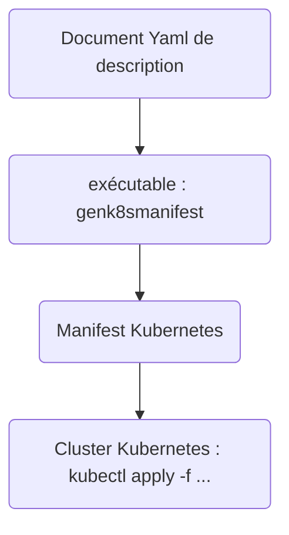
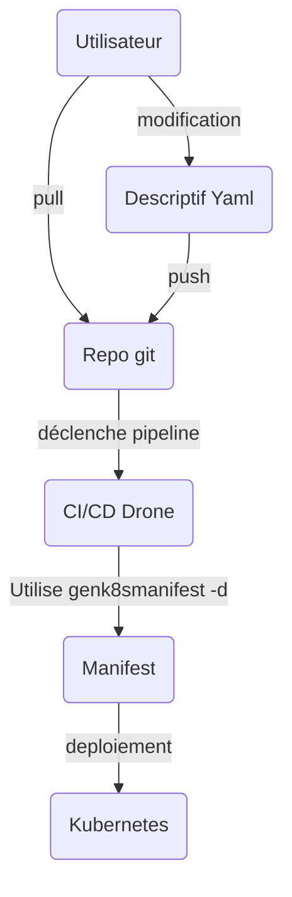

# GenK8sManifest

Générateur de manifest Kubernetes à partir d'une description applicative yaml.

**ATTENTION - Version BETA -> v0.1.0-beta**

## Synopsis

Pour déployer une application dans kubernetes, nous devons passer par la phase "Manifest" ( <a href="https://kubernetes.io/docs/concepts/overview/working-with-objects/kubernetes-objects/" target="_kubernetes_objects">voir la documentation Kubernetes</a> )

L'idée est donc de décrire mes besoins, puis d'exécuter un outil qui fabrique les "Manifests" nécessaires.

Vous pouvez utiliser les "Charts HELM", prévus pour du Cloud Ready, entendez par "Cloud Ready", ready for Google, AWS, AZURE, etc...

Mon cluster Kubernetes est "On-Premise", le problème que je rencontre avec ces "Charts Helm" est souvent situé au niveau du stockage (persistent volume) et du réseau, je dois systématiquement adapter...

Tenter aussi l'expérience de créer un "Chart Helm" (ex: vos propres développements), en dehors du fait que je trouve cela complètement intéressant, c'est surtout très chronophage.

Au lieu de consommer et de perdre mon temps, je fabrique les "Manifests" à partir d'une description qui exprime les besoins applicatifs : namespace, volumes, etc..., en essayant de faire simple et de rester proche de la syntaxe et du concept "Kubernetes".

Ce système permet d'autre part, la gestion de plusieurs environnements pour une même application (développement, production, performance,...) avec une description par environnement.

J'utilise ce concept (Description/Génération) depuis plus de 2 ans maintenant avec une première version entièrement écrite en "bash". Cela fonctionne très bien, mais devient délicat à maintenir.

Cette nouvelle version est la ré-écriture de l'original en "Javascript". Pourquoi Javascript ? Et pourquoi pas ?, d'autant que nodejs est rapide, dispose d'un éco-système très étendu, et supporte notamment le "templating Ejs".

Ce projet intègre des contrôleurs adaptés à mon cas précis, mais le système est extensible au travers du système de template "Ejs" (voir documentation <a href="https://ejs.co/" _target="ejs">Template Ejs</a>)



**Ce générateur ne peut pas convenir à tout le monde**, je l'utilise dans le cadre :

- de la création du "Manifest" complet nécessaire au déploiement d'une application
- de la mise à jour de ces applications au travers de la chaîne CI/CD.  
  Exemple : Mise à jour de Matrix dans mon cluster:
  - "pull" du repo git,
  - modification de la valeur du tag de l'image docker
  - "push" vers le repos git
  - la chaîne CI/CD ("Drone" dans mon cas) se charge de : - générer le manifest, au moyen de l'exécutable "genk8smanifest" - déployer le manifest dans le cluster Kubernetes.



## Todo

- support multi-langues
- réaliser l'intégralités des manifest proposés
- refactoring de certaines portions de code
- Améliorer le taux de couverture des tests unitaires
  ...

## Les Manifests en général

- [x] Namespace - Bien que le namespace ne soit pas une obligation pour Kubernetes, il est important d'appliquer les bonnes pratiques.
- [x] Limitranges
- [x] Environnement d'exécution (variables d'environnement) - Global à tous les containers ou bien spécifique à un container. Par défaut, toutes ces variables d'environnement sont gérées comme des secrets.
- [x] Secrets - Les secrets sont génériques (clé/valeur) à part l'utilisation d'une registry privée, nécessitant une authentification (attribut spécifique "registry")
- [x] Service et Endpoint du stockage persistent - Transparent dans la description, le rendu actuel est spécifique à ma configuration, voir le chapitre "Contexte"). Le endpoint est généré uniquement si présence de l'attribut "glusterfsipaddr".
- [ ] Volumes de stockage persistants - PV et PVC - Le PV est généré uniquement si présence de l'attribut "glusterfsipaddr". Si utilisation de l'attribut "storageclass" dans la description d'un volume persistant, le manifest concernant le "PV" n'est pas généré, je considère que vous disposez d'une configuration "auto-provisionning" @todo.
- [x] Volumes temporaires - Utilise le filesystem du node worker où est exécuté le pod, et décrit dans le manifest "Deployment"
- [x] Deployment
  - [x] Contexte de sécurité
  - [x] Affinité à un type de noeud - permet aussi un scale horizontal : un pod par noeud toujours actif, le loadbalancer se charge des routes, en cas de perte d'un noeud l'application reste online...
  - [ ] autoscaler - @todo
- [x] Services
- [x] Ingress - **Pour l'instant, supporte seulement la notion "host"**
- [x] Egress - Je ne dispose pas de contrôleur réseau permettant l'usage des Egress... Donc non supporté
- [x] ReplicaSet - La documentation Kubernetes indique préférer cette gestion au travers du "Deployment" - Donc non supporté
- @todo :
  - [ ] Cronjob (-cron) -
  - [ ] Configmaps (-cfm) -
  - [ ] Resource Quotas (-rq) -
  - [ ] Service account (-servacc) -
  - [ ] RBAC (-rbac) -

## Templates

**Si vous touchez au contenu des templates en place (/templates), les tests ne fonctionneront plus.**

Pour utiliser un template personnalisé, créer une copie du template original dans un répertoire de votre choix (paramètre "-e [répertoire d'extraction]"). Le projet présente déjà un répertoire prévu à cet effet : "templatescustom", puis utiliser l' argument de ligne de commande "-tplcustomdir" suivi du répertoire contenant les templates personnalisés.

Vous n'êtes pas obligé de copier l'intégralité des templates dans le répertoire personnalisé. Le mécanisme de personnalisation fonctionne par remplacement. Si le template nécessaire se trouve dans le répertoire personnalisé, le programme utilisera ce dernier, sinon le programme utilisera le template original.

## Utilisation avec le code source

Version Nodejs minimum : 16

```
npm install
# génération d'un manifest
node index.js [arguments]
```

## Utilisation avec l'exécutable

Télécharger l'exécutable adapté à votre plateforme à partir du répertoire "dist" de ce repository git.

Les exécutables sont générés par le projet "Pkg" disponible sur le repository "NPM".

## Arguments de commande

- "-v" : Affiche la version de l'application
- "-i [chemin complet ou relatif du fichier de description applicatif (.yml)]" : Document de description de l'application (document yaml)
- "-o [chemin complet ou relatif de sortie du manifest kubernetes (.yml)]" : Manifest généré (par défaut sur la sortie standard STD) (document yaml)
- "-tplcustomdir [chemin complet ou relatif du répertoire contenant les templates personnalisés]"
- "-s" : mode silencieux, n'affiche pas les informations du processus
- "-e [chemin complet ou relatif du répertoire d'extration des templates originaux]"
- Arguments de génération, qui peuvent être combinés :
  - "-n" : Génère uniquement le Manifest "Namespace"
  - "-sec" : Génère uniquement le Manifest "Secrets"
  - "-pv" : Génère uniquement le Manifest "PersistentVolume"
  - "-pvc" : Génère uniquement le Manifest "PersistentVolumeClaim"
  - "-l" : Génère uniquement le Manifest "LimitRange"
  - "-d" : Génère uniquement le Manifest "Deployment" (incluant les secrets)
  - "-serv" : Génère uniquement le Manifest "Service" (incluant Ingress)
  - L'ordre de génération est fixé, le namespace, les ressources, le deployment, les services.

## Tests

Tous les tests sont fait à partir du contenu du fichier "tests/constants.js". Il s'agit d'un contenu générique cohérent. Tous les tests de non conformités seront décrit "en ligne".

**Tous les manifests attendus** (tests/expected-manifests) ont été testés sur un cluster Kubernetes fonctionnel.

Si vous touchez au contenu des templates, vous devrez revoir les tests concernés et notamment re-générer les résultats attendus.

Pour générer un résultat attendu, dans le fichier de test et sur le premier test, dé-commentez la ligne :

```js
[...]
//testLib.saveDocument(result, manifest);
[...]
```

Exécuter le test, vérifier que le résultat soit correct, puis re-commenter la ligne précédemment impactée (Sinon le test sera toujours vrai...).

## Application du Manifest sur le cluster Kubernetes

Selon vos habilitations, vous ne serez pas en mesure d'appliquer l'intégralité des objets contenus dans le manifest générés (Voir avec l'administrateur).

L'utilisateur (peut-être une chaîne CI/CD) ayant accès au "Namespace" définit par l'administrateur, peut gérer, les différents objets Kubernetes fonction des droits octroyés par l'administrateur (RBAC).

Avant d'appliquer définitivement le manifest généré dans votre cluster, vous pouvez le tester en utilisant la commande : `kubectl apply -f [nom du manifest] --dry-run`. Ceci permettra de valider le contenu du Manifest sans injecter ses objets.

## Ingress

Mon choix d'exposition des services s'est porté sur NodePort, et l'utilisation d'un unique Loadbalancer "Haproxy" pour l'ensemble du mon infrastructure. J'ai donc conçu un opérateur (non couvert ici) chargé de mettre à jour haproxy au travers du nouveau système d'APIs. C'est pourquoi les template "ingress" dispose d'une annotation spécifique à mon cas.

## Contexte de stockage

Pour le stockage persistant des données, j'utilise un serveur "Glusterfs", parce que Kubernetes dispose du driver natif et que "Glusterfs" est facile à gérer. Le service Glusterfs de mon infrastructure, par économie, est limité à un noeud et parce que je n'héberge pas de services critiques. A partir de ces spécifications, je ne peux pas utiliser l'opérateur "Heketi" qui nécessite 3 noeuds Glusterfs minimum. Je gère donc les volumes Glusterfs manuellement.

**@todo : Cet outil permet de fournir les commandes permettant de créer les volumes sur le serveur gluster.**

### Volumes

#### Description et utilisation

Les volumes sont décrits dans la partie global : "persistentvolumes" ou "temporaryvolumes", et seront consommés par les containers au moyen de l'attribut "volumes" en indiquant sous forme de listes (array), le nom du ou des volumes a utiliser. Ceci me permet d'avoir une visibilité en une fois des volumes utilisés par l'application...

#### AccessMode

En ce qui concerne le paramètre "accessModes" des volumes (PV et PVC) je vous renvoi à la documentation https://kubernetes.io/docs/concepts/storage/persistent-volumes/

Si l'application est "scalable" sur plusieurs noeuds différents vous devrez utiliser la valeur "ReadOnlyMany". Ceci indique que le volume pourra être monté simultanément sur plusieurs noeuds différents. Sinon Kubernetes indiquera qu'il ne peut pas monter le volume du fait qu'il est déjà monté sur un autre noeud (erreur relative à Bound).

Par défaut j'utilise la valeur ReadWriteOnce pour les applications non scalable, si l'application est scalable, paramètre "global/scalable" alors sa valeur sera "ReadOnlyMany" si cette valeur n'est pas forcé dans le paramétrage du volume..., vous savez ce que vous faîtes. En forçant avec la "ReadOnlyOnce" ceci ne veut pas dire que l'application ne pourra être mise à l'échelle, mais l'opération de montage des volumes ne pourra être exécutée que sur un seul noeud.

Il est donc incompatible d'utiliser access: "RWO" pour une application scalable.

## Détail d'un descriptif applicatif

Voir le fichier "README-Description.md"

## Trucs & astuces

- Regexp remove blank lines : replace(/(\r?\n)\s\*\1+/g, '$1')

- Les annotations dans un manifest doivent toujours être de type "string"

- Cspell ignore javascript & json : fichier ./.vscode/settings.json ajouter : `"cSpell.enableFiletypes": ["!javascript", "!json", "!yaml"]`

## Contribuer

Utilisation de Codium, extensions :

- ejs language support
- Markdown Preview Mermaid Support

Concernant le build des exécutables "cross-platform", utilisation de "qemu" et du package npm "pkg".

### Utilisation de git-lfs

<a href="https://codepre.com/fr/git-lfs-la-mejor-manera-de-manejar-archivos-grandes-en-git.html" target="_gitlfs">Ce site explique clairement l'utilisation de git-lfs</a>

Votre station de développement doit disposer du package git-lfs : `apt-get install git-lfs`

J'utilise Git-Lfs pour les stockage des binaires (/dist/\*), ceci évite à chacun de récupérer le "versioning" des fichiers "lourds" lors d'un "git pull|clone|checkout".

## Exécutables

voir la documentation : https://github.com/hootan09/pkg_nodejs

```
npm install -g pkg
```

La description du "build" des exécutables est indiquée dans l'attribut "pkg" du fichier "package.json"

## Licence

<a href="https://github.com/dhenry123/genk8smanifest/blob/main/LICENSE" target="_agpl">AGPL-3.0 license</a>
